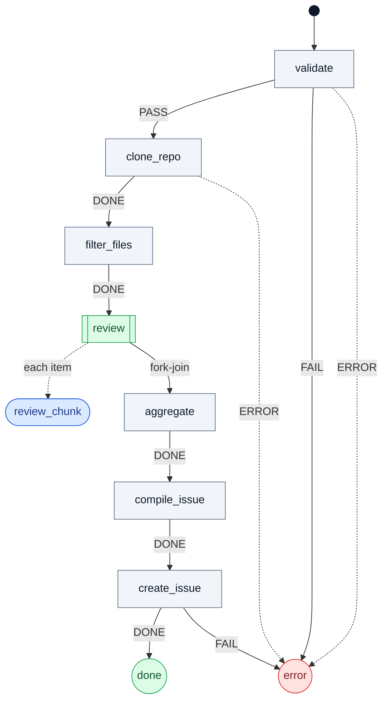

# reharness

[](https://www.npmjs.com/package/reharness) [](LICENSE)

**A reasoning compiler.** Spend a model's intelligence *once*, at compile time, to turn a natural-language request — or a recorded agent trace — into a deterministic finite-state-machine pipeline. Most of the pipeline is ordinary code; only a few clearly-marked **agent** leaves call a model at runtime. The compiled artifact is a persistent, version-controllable directory you can read, test, and ship — and a fully-mechanical task compiles all the way down to **zero runtime model calls** (`0 agent runs · 0 tokens · $0.0000`).

The human approves the **intent** (a short PRD), never the generated graph. Inter-stage data flow is derived from the topology, not declared. The agent leaves run on the **Pi** backend (the runtime keeps a one-adapter seam for adding others).

## Installation

```bash
npm install -g reharness
```

Package: **[npmjs.com/package/reharness](https://www.npmjs.com/package/reharness)**.

reharness runs its agent leaves on the **Pi** backend — install it and put it on `PATH`:

- **Pi** — the minimalist agent CLI (`pi`). See [pi-mono](https://github.com/badlogic/pi-mono).

Provide model/API auth as `pi` expects. Node ≥ 18.

## Quick Start

```bash
# Interactive: design + checkpoint + construct
reharness compile "Code review FSM for this project"

# Agent-driven: skip checkpoint, resolve via auto-event
reharness compile --auto-approve "FSM for generating React Native apps from a one-line idea"

# Run a compiled FSM
reharness                  # Interactive TUI
reharness <command> args   # Direct
```

## How `compile` works

```
research (agent)  — optional domain research (skipped with --fast)
prd (agent)       — distil a human-readable PRD (spec) from request + research
review_prd        — APPROVAL CHECKPOINT (the ONLY thing the human approves)
                    Approve  → design
                    Revise   → discuss_prd (interactive) → re-approve
design (agent)    — one pass: graph + per-node behavioural <contract>
construct (code)  — validate, derive inter-stage wiring from the graph, codegen
fill_prompts      — agent fills agent prompts + code-state implementations
check_dataflow    — deterministic use-before-def report (fed to polish)
polish (agent)    — one pass: review vs PRD + fix leaves (prompts/code); topology issue → redesign (rare)
verify (code)     — TS compile + structural checks → done
```

The human approves the **PRD** — confirmation the compiler understood the intent — never the FSM graph. Everything downstream is generated from the approved PRD. One checkpoint, agent-friendly: `--auto-approve` resolves it via the state's `auto-event` and emits a warning, so the same workflow serves humans and agents.

**Three fronts, one PRD.** The flow above is the natural-language front (`compile <description>`). A **demonstration** (`compile --from-session <path>`) is grounded by the same evidence-adaptive `research` agent (here from the trace's observed facts, into `skills/`) and distilled into a PRD. An **amendment** (`amend <request>`) folds a change into an existing PRD. All three converge at `review_prd` and share everything downstream; the human always approves the PRD, never the graph.

## Writing a pipeline by hand

```typescript
// reharness/commands/build.ts
import { defineCommand, definePipeline } from 'reharness';

export default defineCommand({
  description: 'Build something',
  usage: '<name>',
  run: (args, ctx) => definePipeline({
    config: { name: args[0] },
    initial: 'plan',
    states: {
      plan:   { entry: async (c) => { await c.agent('planner', 'Plan'); },  on: 'code' },
      code:   { entry: async (c) => { await c.agent('coder', 'Build'); },   on: 'verify' },
      verify: {
        entry: async (c) => c.shell('npx tsc --noEmit') ? 'PASS' : 'FAIL',
        on: {
          PASS: 'done',
          FAIL: [
            { target: 'fix', guard: (c) => c.retries('v') < 3 },
            { target: 'error' },
          ],
        },
      },
      fix:    { entry: async (c) => { c.retry('v'); await c.agent('fixer', 'Fix'); }, on: 'verify' },
      done:   { type: 'final', status: 'success' },
      error:  { type: 'final', status: 'error' },
    },
  }),
});
```

## State types

| Type       | Behavior |
|------------|----------|
| `agent`    | LLM agent runs under the state's harness (prompt + tools + contract). |
| `code`     | Deterministic TypeScript function. Returns an event string. |
| `approval` | Runtime pauses, shows artifacts, awaits a chosen event. `auto-event` resolves it in auto-approve mode. |
| `final`    | Terminal: `status: success | error`. |

Composite/routing types — `parallel` (fan-out over an array), `loop` (bounded iteration, `max` required), `switch` (declarative routing), `wait`, `call`, `set`, `interactive` — are documented in [AGENTS.md](AGENTS.md).

## CLI

```bash
reharness                                  # Interactive TUI
reharness <command> [args...]              # Direct run
reharness compile <description>            # Compile a new workflow (interactive checkpoint)
reharness compile --auto-approve <desc>    # Compile autonomously (for agent invocation)
reharness compile --name <id> <desc>       # Name the compiled command yourself
reharness compile --from-session <path>    # Distil a recorded session (any format) into a reusable workflow
reharness amend [<command>] <request>      # Amend a compiled command with a new feature
reharness evolve [<command>]               # Learn from the last run: self-heal / amortize routines into tools / refine skills
reharness graph <command>                  # Write the FSM as Mermaid → <command>.mmd (renders inline on GitHub)
reharness graph <command> --html           # …or a self-contained interactive viewer → <command>.html (click a node)
reharness <command> --dry-run              # Smoke-test routing & data flow with agents/shells stubbed (no tokens)
reharness <command> --resume               # Resume an interrupted run
reharness <command> --evolve               # After the run, auto-chain evolve on its verdict
```

Options: `--model <id>`, `--provider <id>`, `--auto-approve`, `--resume`, `--fast`/`--no-research` (skip web research in
compile/amend), `--no-enhance` (skip the auto-chained harness/skill layer), `--name <id>` (compile only). After a
successful `compile`/`amend`, an **enhance** layer auto-runs (attaches domain-skills per leaf) and a dependency
**manifest** + `setup.sh`/`Dockerfile` are emitted — the compiler derives and renders them, but never installs anything itself.

### Visualizing a pipeline

A compiled pipeline is a graph, so you can look at it. `reharness graph <command>` writes a Mermaid `flowchart` to
`<command>.mmd` (a deterministic pass — no model call) that GitHub and most markdown viewers render inline; `--html`
writes a self-contained interactive viewer to `<command>.html` where clicking a node shows its contract, prompt,
transitions and derived data flow. (`--output <file>` overrides the name; `--output -` streams to stdout.) Here is the
`reviewer` pipeline — *clone a repo → review it → open a GitHub issue* — note that **only one node (`review_chunk`)
is an agent**; everything else is ordinary code:



### Backends (providers)

The agent leaves run on **Pi** (default), **OpenCode**, or **Hermes**; the FSM/compiler are provider-agnostic (a leaf
is just "someone runs it"). A backend is a single adapter in `src/runtime/providers.ts` (argv lowering of the three
harness axes + event-stream normalization + turn-framing + synthesized-tool rendering), so adding another is one
Provider, not a cross-cutting change. Select with `--provider`, `def.provider`, or `REHARNESS_PROVIDER`. `--model` /
`def.piModel` choose the model within the backend.

| | `pi` | `opencode` | `hermes` |
|---|---|---|---|
| install | `npm i -g @mariozechner/pi-coding-agent` | `npm i -g opencode-ai` | [install script](https://github.com/NousResearch/hermes-agent) |
| synthesized tools | `--extension` | generated `tool/` dir | **not supported** (warns) |
| skills | `--skill` | `instructions` | inlined into the prompt |
| in-session validation | one live process | re-spawn + `--session` | **once, then fails loud** |
| streamed events | per tool/message | per tool/message | final text only |

The backends differ in capability, so they are not freely interchangeable. **Hermes cannot load a synthesized tool**
(no path-based tool-loading flag exists in its CLI) and **cannot self-correct** (its `-z` one-shot entry point has no
reachable session resume), so a pipeline whose leaf depends on an `evolve`-extracted routine or on `validate` fix
rounds should stay on `pi` or `opencode`. See AGENTS.md for the full table and the authoring implications.

### Tuning hyperparameters

Two tiers, by whose knob it is:

- **The compiler's & runtime's own knobs** — env vars, one place (`src/config.ts`): `REHARNESS_COMPILER_CONCURRENCY`,
  `REHARNESS_CORRECTION_RETRIES`, `REHARNESS_SHELL_TIMEOUT_MS`, `REHARNESS_POLL_MS`, `REHARNESS_LIGHT_MODEL`,
  `REHARNESS_SESSION_CHUNK_CHARS`, `REHARNESS_EVOLVE_GRACE`, `REHARNESS_AGENT_RETRIES` (transient-failure retries
  per leaf), `REHARNESS_AGENT_BACKOFF_MS` (retry backoff base), `REHARNESS_RUN_RETENTION` (past runs to keep).
  Set the env var to override the default.
- **A pipeline's per-run structural knobs** — `--param state.knob=value` (repeatable), applied at the runtime layer
  so it works the same for a compiled command and for the compiler's own pipelines. `knob ∈ max` (loop iterations),
  `concurrency` (parallel fan-out), `timeoutMs` (any state). Validated up-front and fail-loud — a loop `max`
  override must stay a finite integer ≥1 (the termination guarantee). A `--params <file.json>` profile (a flat
  `{ "state.knob": number }` map) is the base; individual `--param` flags win over it.

```bash
reharness my-flow --param refine.max=10 --param fanout.concurrency=8   # more loop turns, wider fan-out, this run only
reharness my-flow --params ./profiles/thorough.json                    # a saved profile of overrides
```

## Operating in production

- **Backends fail loud, clearly.** If the `pi`/`claude` binary isn't on `PATH` you get an actionable
  *"Backend not found — install it / pass a path"* (not a raw `ENOENT`).
- **Transient resilience.** A leaf whose backend returns a rate-limit / 5xx / dropped connection backs off and
  retries (`REHARNESS_AGENT_RETRIES`, default 2; exponential with jitter). A *content* error (bad request, auth)
  fails fast. Once the budget is spent the leaf fails loud — the FSM never silently stalls.
- **Secrets are redacted** from traces, terminal output and `state.json` (credentials in a URL, `Authorization`
  headers, `sk-`/`ghp_`/`AKIA…` tokens, `key=value` secrets). Defence-in-depth, not a substitute for not putting
  secrets in commands.
- **Disk is bounded.** Each command keeps its newest `REHARNESS_RUN_RETENTION` runs (default 20); older run
  records are pruned automatically. Everything regenerable lives under the gitignored `.cache/`.
- **Termination is guaranteed structurally** — every `loop` carries a required `max`, and every state may set a
  `timeoutMs`. A compiled pipeline is statically checked (reachability, definite-assignment data-flow, workspace
  & substrate rules) before it ever runs.
- **Smoke-test before you spend.** `reharness <command> --dry-run` runs the compiled FSM with every agent, `c.shell`
  and `c.exec` stubbed — it exercises routing, guards and the derived data flow end-to-end for **0 tokens**, turning
  *"it compiled"* into *"it reaches a terminal without a crash or dead-end"*. (It isolates the agent/shell/exec
  seam; a code state that spawns a subprocess *directly* via `child_process` still runs — so generated code prefers
  `c.shell` / `c.exec`, which are abortable, timeout-bounded and dry-run-aware.)

**Known limitations (v0.1.0).** No global wall-clock run timeout (bound individual states with `timeoutMs`). A
command's run records live next to their output target (`<target>/logs/`), so there is no single cross-target run
browser yet. A lifted bundle needs `reharness` installed at its new location (`npm install` in the bundle, once it
is published); a pipeline with **external** dependencies also needs its `setup.sh` (from the derived manifest), not
just `npm install`. While `0.x`, the runtime/compiler API may change between minor versions — a bundle pins the
`reharness` version it was compiled against, and there is no runtime version-compatibility check. A pipeline that
mutates **external targets** (your real files) is not transactional: a re-run may re-apply. Linux/macOS are the
tested platforms (Windows symlink/shell paths are untried). The compiler authors the leaf code; it is a readable,
version-controlled artifact you should review like any code — it is not sandboxed.

## Project structure

The compiled pipeline is a **first-class, liftable bundle**: the `reharness/` directory IS the deliverable —
version it, ship it, `mv` it to another machine, run `npm install` once, and it runs (its `package.json` declares
`reharness` as a dependency, so the generated commands' `import 'reharness'` resolves anywhere). It holds
**several commands** (a workspace of isolated targets); agents, the PRD archive, and synthesized tools are
namespaced per command (`<cmdId>`). Everything regenerable — run logs/state, the evolve ledger, compiler
scratch — is quarantined under a hidden, gitignored `.cache/`.

```
my-project/
└── reharness/                # ← the deliverable (versioned, shippable, liftable)
    ├── skeletons/            # Source of truth — one <cmdId>.xml per command
    ├── prds/                 # Approved intent archive — <cmdId>.md (the "what", human-approved)
    ├── commands/             # Generated from skeletons — do not edit (<cmdId>.ts)
    ├── lib/                  # Code-state implementations (<cmdId>-states.ts, edit freely)
    ├── agents/<cmdId>/       # Per-command agent prompts: <name>/SYSTEM.md (+ optional harness.json)
    ├── skills/               # Shared domain-skills (<topic>.md, attached to leaves via harness.json)
    ├── tools/<cmdId>/        # Synthesized tools amortized by evolve (per command)
    ├── manifest.json         # Derived dependency manifest → setup.sh + Dockerfile (you install, the compiler never does)
    ├── .gitignore            # ignores .cache/ + node_modules/ (so the deliverable versions clean)
    └── .cache/               # run-exhaust — gitignored, safe to delete
        ├── runs/             # Per run: run-*/{state.json, work/<stage>/…, trace/<stage>/NN-stage.md}
        ├── evolve/           # The utility ledger (ledger.json) + .archive of retired tools
        └── scratch/          # Transient compiler scratch (prd.md, draft-skeleton.xml, _compiled.md, errors, …)
```

## Imports

- `reharness` — full public API
- `reharness/runtime` — FSM runtime only (definePipeline, types, agent runner)
- `reharness/compiler` — compilation primitives only (parse/serialize XML, codegen, verify)

## License

Apache 2.0
